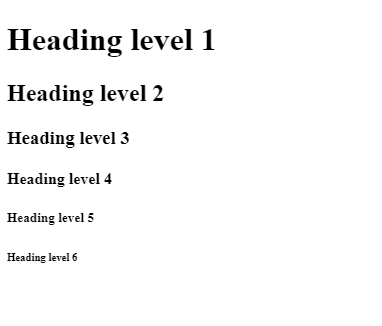

    
Buenos recursos para buscar información con respecto al codigo: MDN, w3schools y devdocs.
## Heading Element
Elementos que pueden ser representados en 6 niveles de encabezado.
```html
<h1>Heading level 1</h1>
<h2>Heading level 2</h2>
<h3>Heading level 3</h3>
<h4>Heading level 4</h4>
<h5>Heading level 5</h5>
<h6>Heading level 6</h6>
```



Existen distintos elementos de html en la cuales estan los que tienen un start-tag y closing-tag:
```html
<h1><-Starting Closing-></h1>
```
Otros como son los Self-closing tag ejemplos:
```html
<br>
<hr>
```
Y cada elemento html puede tener su atributo:
```html
<!-- size y noshade vendrian siendo atributos de hr -->
<hr size:"4" noshade>
```
ejemplo:
Tenemos un divisor sin atributos
<hr>
Y otro añadiendole atributos
<hr size:"4" noshade>

Actividad:
```html
<center>
<hr size="3" noshade>
<h1>The Adventures of <br> Sherlock Holmes</h1>
<br>
<h3>by</h3>
<br>
<h2>Arthur Conan Doyle</h2>
<hr>
</center>
```
