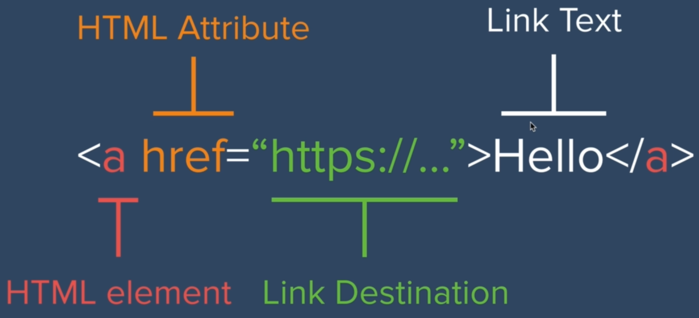

```html
<!DOCTYPE html>
```
Indicara la estructura del doctype del html.

Recurso para abreviaciones y ahorrar tiempo :+1: :
[Emmet.io](https://docs.emmet.io/cheat-sheet/)

Lista de todo los caracteres UTF-8 (estandar encondig):
[UTF-8 List](https://www.fileformat.info/info/charset/UTF-8/list.htm)

Meta: Servira para importar informacion al documento.
[Atributos](https://developer.mozilla.org/es/docs/Web/HTML/Element/meta)

Siempre es mejor utilizar:
 ```html
<em></em>
``` 
en vez de
```html
 <i></i>
 ``` 
 o 
 ```html
 <strong></strong>
 ``` 
 en vez de
 ```html
  <b></b>
  ```
  Para mayor uso de información.
# Hyperlink
Para insertar un hipervinculo se utiliza el anchor tag 
```html
<a href="#" >Link</a>
```
